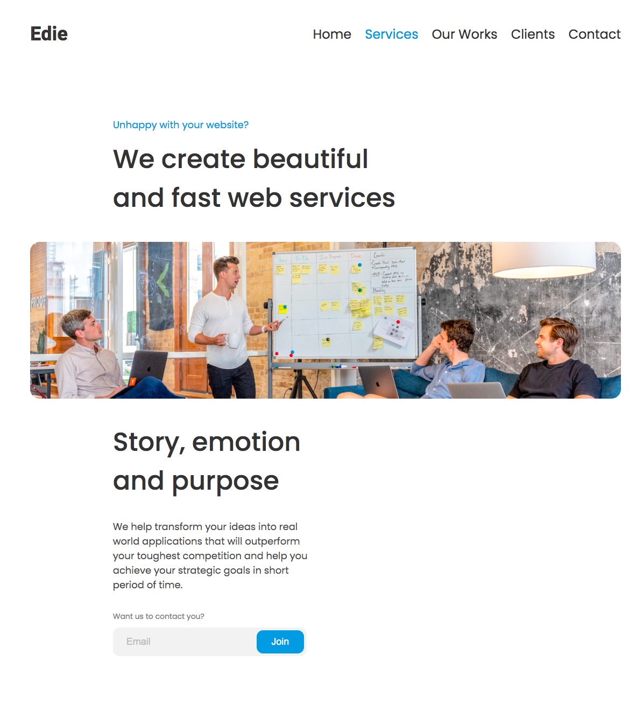

<!-- Please update value in the {}  -->

<h1 align="center">Edie Homepage</h1>

   Solution for a challenge from  <a href="http://devchallenges.io" target="_blank">Devchallenges.io</a>.

  <h3>
    <a href="https://edie-homepage-solution-fatimagr.vercel.app">
      Demo
    </a>
     | 
    <a href="https://github.com/FatimaGR/Edie-homepage">
      Solution
    </a>
     | 
    <a href="https://devchallenges.io/challenges/xobQBuf8zWWmiYMIAZe0">
      Challenge
    </a>
  </h3>

<!-- OVERVIEW -->

## Overview

### The challenge

Create a static page with HTML and CSS following the designs. Fulfill user stories below:

- [✓] I can see a page following the given design
- [✓] I can see a page on mobile following the given design
- [✓] I can go to certain locations by selecting links in navigation or footer
### Built With

- HTML
- CSS

<!-- THE CHALLENGE -->
## Contact

- Website - [Fatima Gallardo](https://porfolio-website-gules.vercel.app)
- GitHub - [@FatimaGR](https://github.com/FatimaGR)
- Dev challenges - [@FatimaGR](https://devchallenges.io/portfolio/FatimaGR)